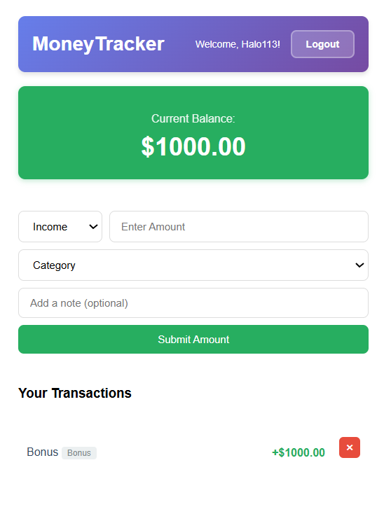
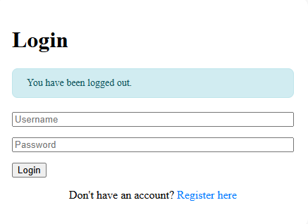

# MoneyTracker Website
**Project Name:** MoneyTracker 
**Author:** Lionel Timothy Tarigan 
**Short Description:** A simple and useful web app to help users track their income and expenses at one website!

---

## Project Description
MoneyTracker is designed to help users manage their finances more efficiently.  
It allows users to record their income, expenses and also categorize their transactions.
This project can be useful for simple personal budgeting, financial planning, or just a way to keep a better eye on your money.

---

## Features
Here are the main features of the MoneyTracker:

- **Income & Expense Tracking:** Add and delete transactions easily.  
- **Categorization:** Organize transactions into categories like Food, Salary, Bills, etc.  
- **Dashboard:** View a summary of your balance, total income, and expenses.   
- **Responsive Design:** Works well on desktop and Other Devices ( In Progress ).  

---

## Demo
See the app in action:  


    


---

## How can you contribute?
You can contribute by using this website! or give me a feedback! Or if you want to, you can edit the codes and features since its Open Source!

---

## Conclusions 
MoneyTracker Website is a simple yet powerful tool to help users manage their finances smarter.
With continuous feedback and updates, it can grow into a full featured personal finance assistant.

---

## Installation & Usage
Follow these steps to get the MoneyTracker running locally:

```bash
git clone [https://github.com/Timmy675g/Final-Project-MoneyTracker]
